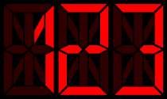
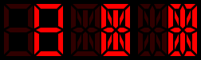
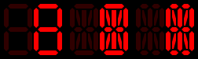
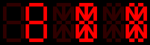
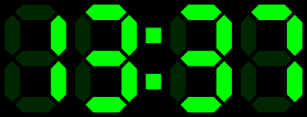

# Segment display widget


[](https://pub.dartlang.org/packages/segment_display)
[](https://travis-ci.com/janstol/flutter_segment_display)
[](https://janstol.github.io/flutter_segment_display/)

Segment display widget for [Flutter](https://flutter.dev). 
Supports multiple types of segment displays and segment customization.

## Contents
* [Features](#features)
* [Installation](#installation)
* Usage
  - [Seven-segment display](#seven-segment-display)
  - [Fourteen-segment display](#fourteen-segment-display)
  - [Sixteen-segment display](#sixteen-segment-display)
* [Styles and customization](#styles-and-customization)
  - [Segment style](#segment-style)
  - [Custom segment styles](#custom-segment-styles)
* [Features and bugs](#features-and-bugs)

## Features
* 7-segment display
* 14-segment display
* 16-segment display
* Customizable segment shapes (segment styles)
* Supports `.` (decimal point) and `:` (colon) characters

See [WEB DEMO](https://janstol.github.io/flutter_segment_display/).
> NOTE: Flutter web support is currently in beta, so you may experience some issues.

## [Installation](https://pub.dev/packages/segment_display#-installing-tab-)
1. **Depend on it**

Add this to your package's pubspec.yaml file:
```yaml
dependencies:
  segment_display: ^0.4.2
```
2. **Install it**

You can install packages from the command line:
```
$ flutter packages get
```
Alternatively, your editor might support flutter packages get. Check the docs for your editor to learn more.

3. **Import it**

Now in your Dart code, you can use:
```dart
import 'package:segment_display/segment_display.dart';
```

## Usage

### Seven-segment display
[CHARACTERS](img/displays/seven_segment.png)

**Example:**  
```dart
SevenSegmentDisplay(
  value: "123",
  size: 12.0,
)
``` 


### Fourteen-segment display
[CHARACTERS](img/displays/fourteen_segment.png)

**Example:**  
```dart
FourteenSegmentDisplay(
  value: "123",
  size: 12.0,
)
```


### Sixteen-segment display
[CHARACTERS](img/displays/sixteen-segment.png)

**Example:**  
```dart
SixteenSegmentDisplay(
  value: "123",
  size: 12.0,
)
```  


## Styles and customization
You can customize segment display with:
- `characterSpacing`- space between individual characters
- `backgroundColor` - display background color
- `segmentStyle` - style for segments (shape, color,...), see [segment style](#segment-style)

**Example:**
```dart
SevenSegmentDisplay(
  text: "123",
  textSize: 12.0,
  characterSpacing: 10.0,
  backgroundColor: Colors.transparent,
  segmentStyle: HexSegmentStyle(
    enabledColor: Colors.red,
    disabledColor: Colors.red.withOpacity(0.15),
  ),
)
```

### Segment style
To change segment color, size or shape, use segment style.

**There are following segment styles:**
- DefaultSegmentStyle  

- HexSegmentStyle  

- RectSegmentStyle  


and you can also **create or own style (shape)** - see [custom segment styles](#custom-segment-styles)

**Example:**
```dart
SevenSegmentDisplay(
  value: "13:37",
  size: 12.0,
  segmentStyle: HexSegmentStyle(
    enabledColor: const Color(0xFF00FF00),
    disabledColor: const Color(0xFF00FF00).withOpacity(0.15),
    segmentBaseSize: const Size(1.0, 2.0),
  ),
)
```


- `enabledColor` - color of enabled segments
- `disabledColor` - color of disabled segments
- `segmentBaseSize` - size ratio for segments; `Size(1.0, 2.0)` basically means that ratio will be 1:2 *(width:length)*
> NOTE: `SegmentStyle.segmentBaseSize` * `SegmentDisplay.textSize` = segmentSize


### Custom segment styles
To create your own segment style (shape), extends `SegmentStyle` class and implement methods 
`createHorizontalPath`, `createVerticalPath`, `createDiagonalBackwardPath` and `createDiagonalForwardPath`.

```dart
class CustomSegmentStyle extends SegmentStyle {

  const CustomSegmentStyle({
    Size segmentBaseSize,
    Color enabledColor,
    Color disabledColor,
  }) : super(
          segmentBaseSize: segmentBaseSize,
          enabledColor: enabledColor,
          disabledColor: disabledColor,
        );
  @override
  Path createHorizontalPath(SegmentPosition position, Size segmentSize) {
    // ...
  }
  
  @override
  Path createVerticalPath(SegmentPosition position, Size segmentSize) {
    // ...
  }
  
  @override
  Path createDiagonalBackwardPath(SegmentPosition position, Size segmentSize) {
    // ...
  }
  
  @override
  Path createDiagonalForwardPath(SegmentPosition position, Size segmentSize) {
    // ...
  }
}
```
You can also customize shape for individual segments by overriding `createPath**` methods.
For 7-segment display, there are `createPath7*` methods, for 14-segment display `createPath14*` and so on.

Example: if you want to change the shape of the top segment in 7-segment display, you just have to override `createPath7A` method.

```dart
class CustomSegmentStyle extends SegmentStyle {

  // ..
  
  @override
  Path createPath7A(Size segmentSize, double padding) {
    // ...
  }
  
  // ...
  
}
```
> NOTE: `createPath**` methods use `createHorizontalPath`/`createVerticalPath`/`createDiagonalBackwardPath`/`createDiagonalForwardPath` by default so you don't have to override all `createPath7*` methods.


## Features and bugs

Please file feature requests and bugs at the [issue tracker][tracker].

[tracker]: https://github.com/janstol/flutter_segment_display/issues
